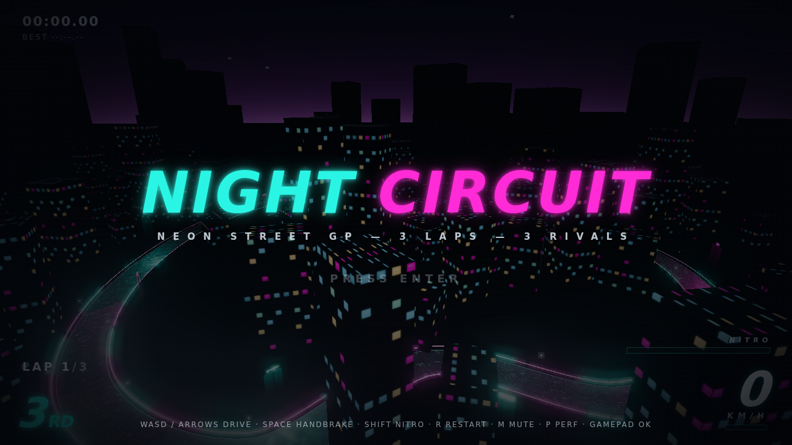

# NIGHT CIRCUIT — neon arcade racer

A night-time street racer in Three.js: wet reflective asphalt, teal/magenta neon,
bloom, drift-to-nitro arcade handling, 3 rubber-band AI rivals, 3 laps.

## Run

```bash
npm install
npm run dev
```

Open the printed URL (default `http://localhost:5173`) in desktop Chrome.
Press **ENTER** on the title screen to start the race.

## Controls

| Key | Action |
| --- | --- |
| `W` / `↑` | Throttle |
| `S` / `↓` | Brake / reverse |
| `A` `D` / `←` `→` | Steer |
| `Space` | Handbrake (drift) |
| `Shift` | Fire nitro (charges while drifting) |
| `R` | Restart race |
| `M` | Mute |
| `Enter` | Start race |

## Rules

- 3 laps, 4 cars, checkpointed lap counting, live positions.
- Walls and rivals bounce you — no teleports.
- Drift (Space) through corners to charge the NITRO meter; fire it with Shift.

## Tech

- Vite + TypeScript + three.js. Zero downloaded assets: every mesh, texture
  (canvas), shader and sound (Web Audio) is generated at runtime.
- Fixed 120 Hz physics, instanced city props, one bloom pass — built for 60 fps.
- See `PLAN.md` for architecture and `DEBT.md` for known compromises.

---

